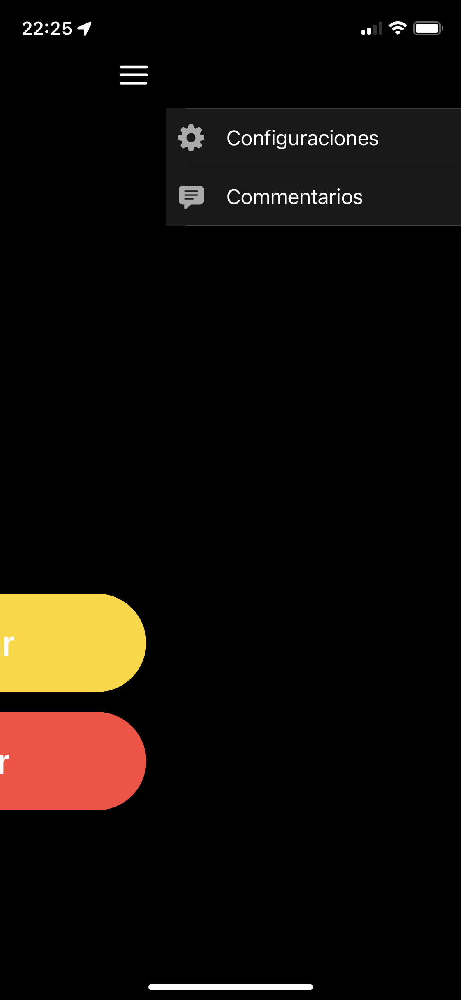
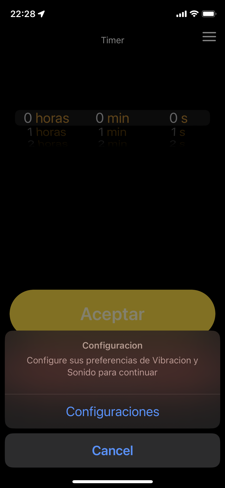
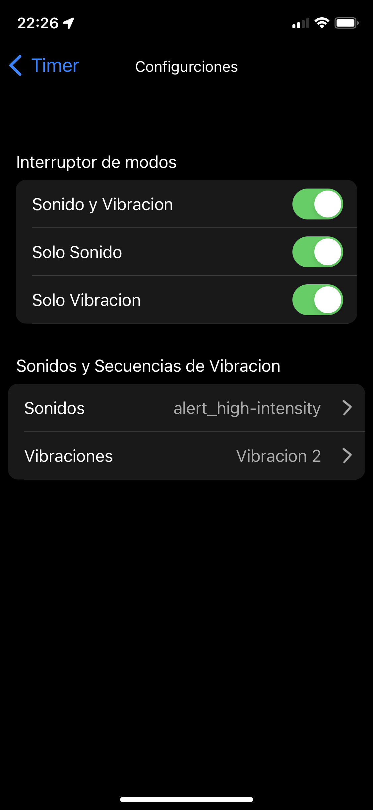
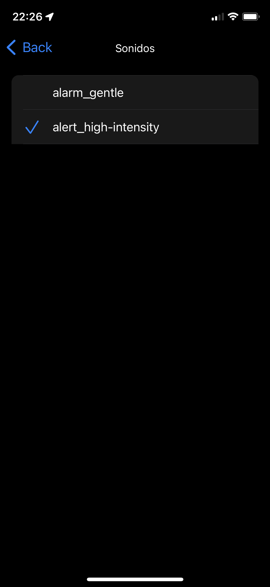
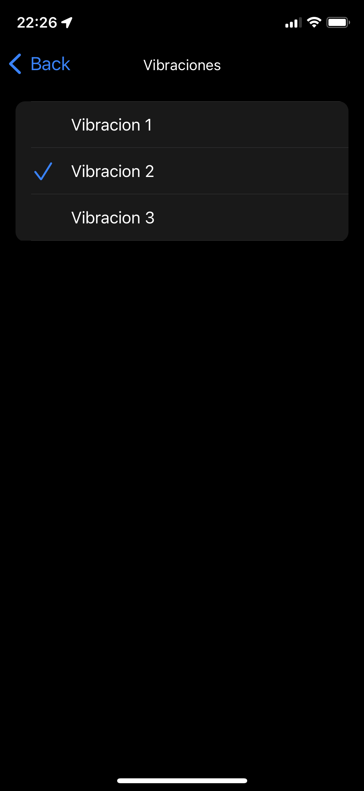
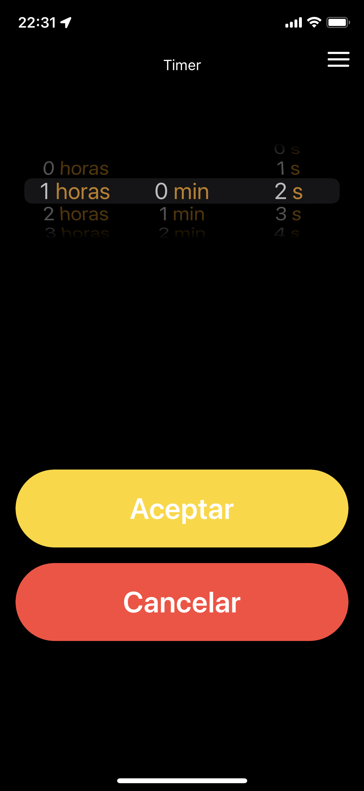
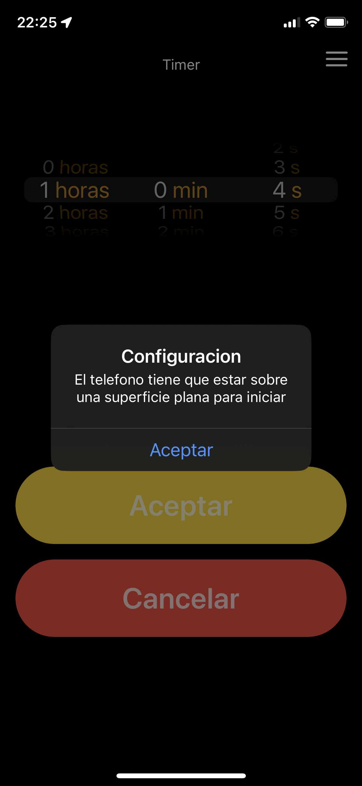
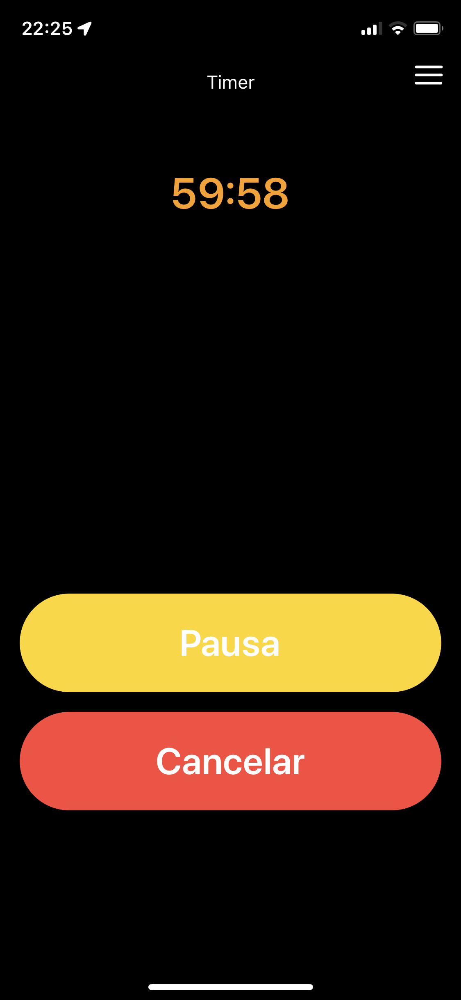

# Demo Timer

### Author: Hector Guadalupe Climaco Flores
#### Email: hclimaco14@gmail.com
Meking a timer using swift lenguage

 Application created with clean architecture,to make a timer,list and save configurations and comments, published in test flight 

### The use of:

- Genericts
- Unit Test
- Delegate
- Codables
- Inheritance
- Cocoa Pods
- Properties observers 

## How use:

### 1 Configure sound and vibrations
if you don't configure preferences show an alert

  
&nbsp;&nbsp;&nbsp;&nbsp;
  

### 2 Select modes
by default selected first option

  
&nbsp;&nbsp;
  
&nbsp;&nbsp;
  

### 3 Configure time
if the phone is not face up show next alert 

  
&nbsp;&nbsp;
  
 &nbsp;&nbsp;
  

